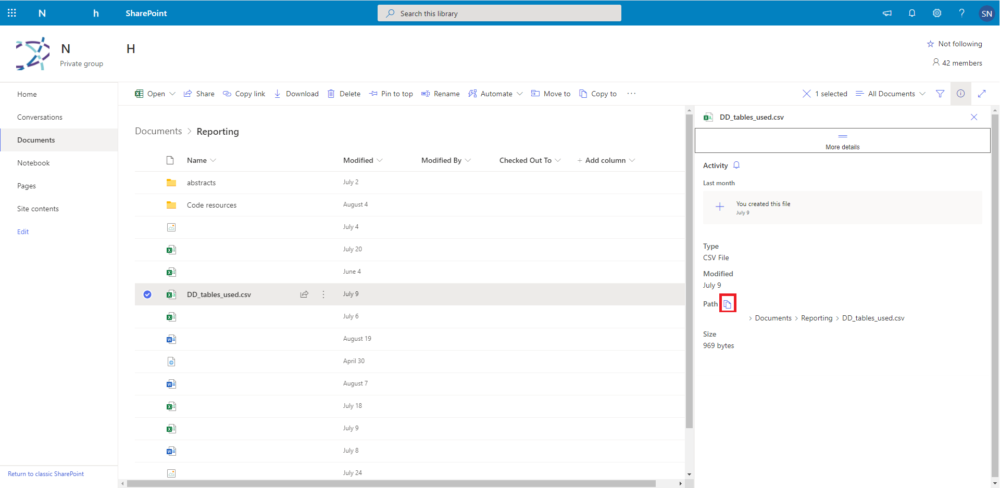

<!-- README.md is generated from README.Rmd. Please edit that file -->

```{r, include = FALSE}
knitr::opts_chunk$set(
  collapse = TRUE,
  comment = "#>",
  fig.path = "man/figures/README-",
  out.width = "100%",
  eval = F
)

options(width = 999)
```

# sharepointR

<!-- badges: start -->
<!-- badges: end -->

The goal of sharepointR is to create some functions to perform CRUD operations to SharePoint places (directories where files from Teams are kept).

> This package was originally built for an in-house project (some hardcoded addresses), and I've since moved to
make it a general package. Hopefully it is a smooth transition for other users (you!). I've also hid much output
in the README and vignettes for secruity reasons.

## Installation

Clone and build from here

```{r setup}
library(sharepointR)
```

## The process

There are two approaches to doing things with `sharepointR`:  

  1. Quick download of a file  
  2. Creating a connection object, navigating around and doing things  

### Quick download

#### Getting the file URL

In order to download a file you must know it's URL. Within the sharepoint site, hover over a file and click 'see details'. On the right pane, click 'More details'. Then click the copy path link (an icon). This will give you the URL

```{r, out.width='90%', fig.align='center', eval = T}

```

#### Downloading

Use `sp_qget()` (quick get). This requires the full URL, a destination file save name, and your credentials. Use `get_config = T` when on on work site, where network issues maybe occur.

```{r sp_qget}
sp_qget(url = "https://n...h.sharepoint.com/sites/N...H/Shared Documents/Reporting/DD_tables_used.csv",
        destfile = 'DD_tables_used.csv',
        username = 'me@myplace.com', 
        password = keyring::key_get('mail'), 
        get_config = T)
```
  

### Using a connection object

#### Create a SharePoint connection

Obtain your sharepoint URL. Use `sp_connection()` with your user credentials. This will create a list of objects required to move on.

```{r sp_connection}
sp_con <- 
  sp_connection(site = 'https://n...w.sharepoint.com/sites/N...H',
                username = 'shaun.nielsen@health.nsw.gov.au', 
                password = keyring::key_get('mail'), 
                get_config = T)
```

The print method of the list shows you only what is relevant.

```{r sp_con}
sp_con
```

#### List contents of a folder

`sp_list_contents()` will list the folder and files contents. It also provides the `ServerRelativeUrl` for nagivating down directory trees. This value can be used with the parameter `rurl` in other `sharepointR` functions. However, relative URLs (rurl) can be of two flavours. If you chose to skip the 'sites' part (`/sites/your_team`), be sure to **not** have a leading `/` (many examples shown below)

```{r sp_list_contents}
sp_list_contents(sp_con)
```

ServerRelativeUrl flavour 

```{r, eval = F}
sp_list_contents(sp_con, '/sites/N...H/Shared Documents')
```

or without

```{r sp_list_contents_2}
sp_list_contents(sp_con, 'Shared Documents')
```


#### Get a file

This requires you to know the relative URL. Use `sp_get_file()`. The relative URL (rurl) should include the file. You can 'save-as' by using the `destfile` parameter.  

ServerRelativeUrl flavour 

```{r sp_get_file}
sp_get_file(connection = sp_con, 
            rurl = '/sites/N...H/Shared Documents/Reporting/DD_tables_used.csv')
```

```{r sp_get_file_2}
sp_get_file(connection = sp_con, 
            rurl = '/sites/N...H/Shared Documents/Reporting/DD_tables_used.csv', 
            destfile = 'test.csv')
```

or without

```{r, eval = F}
sp_get_file(connection = sp_con, 
            rurl = 'Shared Documents/Reporting/DD_tables_used.csv')
```

#### Post a file

The verb post is used in line with the HTTP POST verb. Use `sp_post_file`. The relative URL (rurl) should only be the folder destination.  

ServerRelativeUrl flavour 

```{r sp_post_file}
sp_post_file(connection = sp_con, 
             rurl = '/sites/N...H/Shared Documents/Reporting', 
             file = 'test.csv')
```

or without

```{r sp_post_file_2}
sp_post_file(connection = sp_con, 
             rurl = 'Shared Documents/Reporting', 
             file = 'test.csv')
```

#### Create a folder

Use `sp_create_folder` to create a folder.  

ServerRelativeUrl flavour 

```{r sp_create_folder}
sp_create_folder(connection = sp_con, 
                 rurl = '/sites/N...H/Shared Documents/Reporting/test folder')
```
 
 or without
 
```{r sp_create_folder_2}
sp_create_folder(sp_con, 
                 rurl = 'Shared Documents/Reporting/test folder')
```
